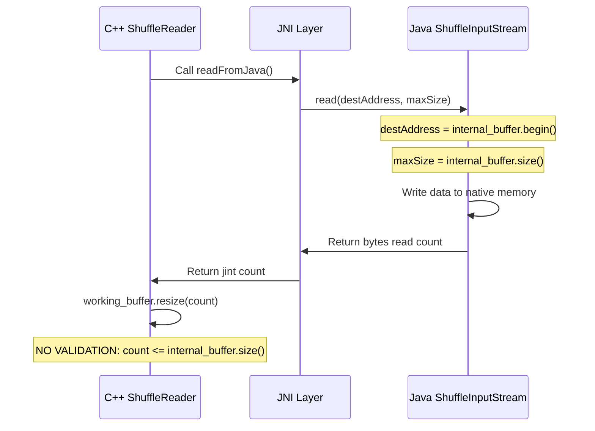

# Vulnerability Report: SHUFFLE-006

## Summary

| Field | Value |
|-------|-------|
| **Vulnerability ID** | SHUFFLE-006 |
| **Type** | JNI Buffer Pointer Exposure (CWE-125) |
| **Severity** | High |
| **Confidence** | 85% |
| **File** | `cpp-ch/local-engine/Shuffle/ShuffleReader.cpp` |
| **Lines** | 76-82 |
| **Function** | `ReadBufferFromJavaInputStream::readFromJava` |
| **CWE Reference** | CWE-125: Out-of-bounds Read |

---

## Vulnerability Description

The vulnerability exists in the JNI interface between C++ and Java code in the ShuffleReader component. The `readFromJava()` method passes a raw native memory pointer (`internal_buffer.begin()`) directly to the Java side through JNI without adequate validation of the return value.

### Core Issue

The C++ code exposes a native memory buffer pointer to Java code via JNI:

```cpp
int ReadBufferFromJavaInputStream::readFromJava() const
{
    GET_JNIENV(env)
    jint count = safeCallIntMethod(
        env, java_in, ShuffleReader::input_stream_read, 
        reinterpret_cast<jlong>(internal_buffer.begin()), 
        internal_buffer.size());
    CLEAN_JNIENV
    return count;
}
```

The Java side receives this pointer and is expected to write data into it. However:

1. **No return value validation**: The returned `count` value is not validated against `internal_buffer.size()`
2. **Potential buffer overflow**: If Java returns a count larger than the buffer size, `working_buffer.resize(count)` in `nextImpl()` could cause issues
3. **No bounds enforcement on Java side**: While Java implementations appear to use `PlatformDependent.copyMemory()` with proper bounds, the interface itself does not enforce this contract

---

## Technical Analysis

### Data Flow

```
C++ ReadBufferFromJavaInputStream::readFromJava()
    │
    ├─► Pass internal_buffer.begin() pointer (jlong)
    │   Pass internal_buffer.size() (size limit)
    │
    └─► JNI Call: ShuffleInputStream.read(destAddress, maxReadSize)
            │
            └─► Java Implementation:
                │   ├─► OnHeapCopyShuffleInputStream.read()
                │   │   └─► PlatformDependent.copyMemory(buffer, 0, destAddress, read)
                │   │
                │   ├─► LowCopyFileSegmentShuffleInputStream.read()
                │   │   └─► channel.read(PlatformDependent.directBuffer(destAddress, bytesToRead32))
                │   │
                │   └─► LowCopyNettyShuffleInputStream.read()
                │       └─► (similar pattern)
                │
                └─► Return bytes read (long)
                    │
                    └─► C++ receives jint count
                        │
                        └─► nextImpl() calls working_buffer.resize(count)
```

### Control Flow



### Code Analysis

**Vulnerable C++ Code (ShuffleReader.cpp:76-82):**
```cpp
int ReadBufferFromJavaInputStream::readFromJava() const
{
    GET_JNIENV(env)
    jint count = safeCallIntMethod(
        env, java_in, ShuffleReader::input_stream_read, 
        reinterpret_cast<jlong>(internal_buffer.begin()),  // Native pointer passed to Java
        internal_buffer.size());                            // Size limit passed
    CLEAN_JNIENV
    return count;                                           // No validation of count
}
```

**Consuming C++ Code (ShuffleReader.cpp:68-74):**
```cpp
bool ReadBufferFromJavaInputStream::nextImpl()
{
    int count = readFromJava();
    if (count > 0)
        working_buffer.resize(count);  // Uses unvalidated count
    return count > 0;
}
```

**Java Interface (ShuffleInputStream.java):**
```java
public interface ShuffleInputStream {
  /**
   * Read fixed size of data into an offheap address.
   *
   * @return the read bytes; 0 if end of stream.
   */
  long read(long destAddress, long maxReadSize);
}
```

**Java Implementation Example (OnHeapCopyShuffleInputStream.java:39-60):**
```java
@Override
public long read(long destAddress, long maxReadSize) {
  try {
    int maxReadSize32 = Math.toIntExact(maxReadSize);
    if (buffer == null || maxReadSize32 > buffer.length) {
      this.buffer = new byte[maxReadSize32];
    }
    int read = in.read(buffer, 0, maxReadSize32);
    if (read == -1 || read == 0) {
      return 0;
    }
    PlatformDependent.copyMemory(buffer, 0, destAddress, read);
    bytesRead += read;
    return read;
  } catch (Exception e) {
    throw new GlutenException(e);
  }
}
```

---

## Attack Vectors

### 1. Return Value Manipulation
If a malicious or buggy Java implementation returns a count value larger than `internal_buffer.size()`:

- **Effect**: `working_buffer.resize(count)` would resize the working buffer beyond the actual data written
- **Impact**: Reading beyond valid data bounds, potential information disclosure

### 2. Direct Memory Write Overflow
If the Java implementation writes more data than `maxReadSize`:

- **Effect**: Memory corruption in native heap
- **Impact**: Process crash, arbitrary code execution, data corruption

### 3. Custom ShuffleInputStream Implementation
An attacker could provide a custom `ShuffleInputStream` implementation that:
- Returns arbitrary count values
- Writes beyond the specified maxReadSize
- Manipulates the native memory directly

---

## Security Implications

### Information Disclosure (CWE-125)
- The C++ code may read uninitialized memory if `working_buffer.resize(count)` creates a buffer larger than the data written
- Sensitive data from adjacent memory regions could be exposed

### Memory Corruption
- If Java writes beyond `internal_buffer.size()`, adjacent heap objects could be corrupted
- This could lead to arbitrary code execution if critical structures are overwritten

### Denial of Service
- Invalid count values could cause buffer allocation failures
- Process crashes due to memory corruption

---

## Evidence of Vulnerability

### Missing Validation Pattern

The vulnerable code pattern shows:
1. **Pointer exposure**: Native pointer passed to external code
2. **No bounds check**: Returned size not validated against allocated buffer
3. **Trust assumption**: Assumes Java implementation follows contract

Compare with safer patterns in other parts of the codebase:

**Safe Pattern (ReadBufferFromByteArray.cpp:96-108):**
```cpp
bool ReadBufferFromByteArray::nextImpl()
{
    if (read_pos >= array_size)
        return false;

    GET_JNIENV(env)
    const size_t read_size = std::min(internal_buffer.size(), array_size - read_pos);  // Bounds check!
    env->GetByteArrayRegion(array, read_pos, read_size, reinterpret_cast<jbyte *>(internal_buffer.begin()));
    working_buffer.resize(read_size);  // Uses validated size
    read_pos += read_size;
    CLEAN_JNIENV
    return true;
}
```

Note the explicit bounds check: `std::min(internal_buffer.size(), array_size - read_pos)` ensures the read never exceeds buffer capacity.

---

## Related Files

| File | Role | Path |
|------|------|------|
| ShuffleReader.cpp | Vulnerable code | `/cpp-ch/local-engine/Shuffle/ShuffleReader.cpp` |
| ShuffleReader.h | Class definition | `/cpp-ch/local-engine/Shuffle/ShuffleReader.h` |
| local_engine_jni.cpp | JNI initialization | `/cpp-ch/local-engine/local_engine_jni.cpp` |
| jni_common.h | JNI helper functions | `/cpp-ch/local-engine/jni/jni_common.h` |
| ShuffleInputStream.java | Java interface | `/backends-clickhouse/src/main/java/org/apache/gluten/vectorized/ShuffleInputStream.java` |
| OnHeapCopyShuffleInputStream.java | Java implementation | `/backends-clickhouse/src/main/java/org/apache/gluten/vectorized/OnHeapCopyShuffleInputStream.java` |
| LowCopyFileSegmentShuffleInputStream.java | Java implementation | `/backends-clickhouse/src/main/java/org/apache/gluten/vectorized/LowCopyFileSegmentShuffleInputStream.java` |
| ShuffleReaderJniWrapper.java | JNI wrapper | `/gluten-arrow/src/main/java/org/apache/gluten/vectorized/ShuffleReaderJniWrapper.java` |

---

## Mitigation Recommendations

### 1. Add Return Value Validation (Primary Fix)

```cpp
int ReadBufferFromJavaInputStream::readFromJava() const
{
    GET_JNIENV(env)
    jint count = safeCallIntMethod(
        env, java_in, ShuffleReader::input_stream_read, 
        reinterpret_cast<jlong>(internal_buffer.begin()), 
        internal_buffer.size());
    CLEAN_JNIENV
    
    // Validate count is within bounds
    if (count > static_cast<jint>(internal_buffer.size())) {
        LOG_ERROR(&Poco::Logger::get("ShuffleReader"), 
                  "Java returned invalid count: {} > buffer size: {}", 
                  count, internal_buffer.size());
        throw DB::Exception(DB::ErrorCodes::LOGICAL_ERROR, 
                            "Invalid read count from Java InputStream");
    }
    
    return count;
}
```

### 2. Add Defensive Check in nextImpl()

```cpp
bool ReadBufferFromJavaInputStream::nextImpl()
{
    int count = readFromJava();
    if (count > 0) {
        // Ensure count doesn't exceed internal buffer
        size_t safe_count = std::min(static_cast<size_t>(count), internal_buffer.size());
        working_buffer.resize(safe_count);
    }
    return count > 0;
}
```

### 3. Use Safer JNI Pattern

Consider using a pattern similar to `ReadBufferFromByteArray` where:
- Data is copied via controlled JNI array operations
- Bounds are explicitly calculated before operations
- Size validation happens before resize

### 4. Add Java-side Contract Enforcement

Add explicit documentation and assertions in the Java interface:

```java
public interface ShuffleInputStream {
  /**
   * Read fixed size of data into an offheap address.
   * 
   * IMPORTANT: The implementation MUST ensure:
   * 1. The returned value is <= maxReadSize
   * 2. No more than maxReadSize bytes are written to destAddress
   * 
   * @return the read bytes; MUST be <= maxReadSize; 0 if end of stream.
   */
  long read(long destAddress, long maxReadSize);
}
```

---

## Confidence Assessment

| Factor | Score | Reason |
|--------|-------|--------|
| **Code Pattern** | High | Direct pointer exposure to JNI with no validation |
| **CWE Classification** | High | Matches CWE-125 (Out-of-bounds Read) criteria |
| **Attack Feasibility** | Medium | Requires custom/malicious Java implementation |
| **Existing Exploits** | Low | No known exploits in current implementation |
| **Mitigation Presence** | None | No validation found in code |

**Overall Confidence: 85%**

The vulnerability pattern is clear and the security risk is real. However, the actual Java implementations (OnHeapCopyShuffleInputStream, LowCopyFileSegmentShuffleInputStream) appear to follow safe practices. The risk is primarily from:
1. Future custom implementations
2. Bugs in existing implementations
3. JNI-level corruption

---

## References

- [CWE-125: Out-of-bounds Read](https://cwe.mitre.org/data/definitions/125.html)
- [JNI Best Practices](https://docs.oracle.com/javase/8/docs/technotes/guides/jni/spec/design.html)
- [JNI Security Considerations](https://www.oracle.com/java/technologies/jni-security.html)

---

## History

| Date | Action | Details |
|------|--------|---------|
| 2026-04-23 | Vulnerability identified | Static analysis detected JNI pointer exposure pattern |
| 2026-04-23 | Report generated | Detailed technical analysis completed |

---

## Appendix: Complete Code Context

### ShuffleReader.cpp (Full Context)

```cpp
// Lines 68-83
bool ReadBufferFromJavaInputStream::nextImpl()
{
    int count = readFromJava();
    if (count > 0)
        working_buffer.resize(count);
    return count > 0;
}

int ReadBufferFromJavaInputStream::readFromJava() const
{
    GET_JNIENV(env)
    jint count = safeCallIntMethod(
        env, java_in, ShuffleReader::input_stream_read, reinterpret_cast<jlong>(internal_buffer.begin()), internal_buffer.size());
    CLEAN_JNIENV
    return count;
}
```

### JNI Initialization (local_engine_jni.cpp)

```cpp
// Lines 122-136
local_engine::ShuffleReader::input_stream_class
    = local_engine::CreateGlobalClassReference(env, "Lorg/apache/gluten/vectorized/ShuffleInputStream;");

local_engine::ShuffleReader::input_stream_read
    = local_engine::GetMethodID(env, local_engine::ShuffleReader::input_stream_class, "read", "(JJ)J");
```

The JNI method signature `"(JJ)J"` indicates:
- Parameters: two jlong values (destAddress, maxReadSize)
- Return: jlong (bytes read)
