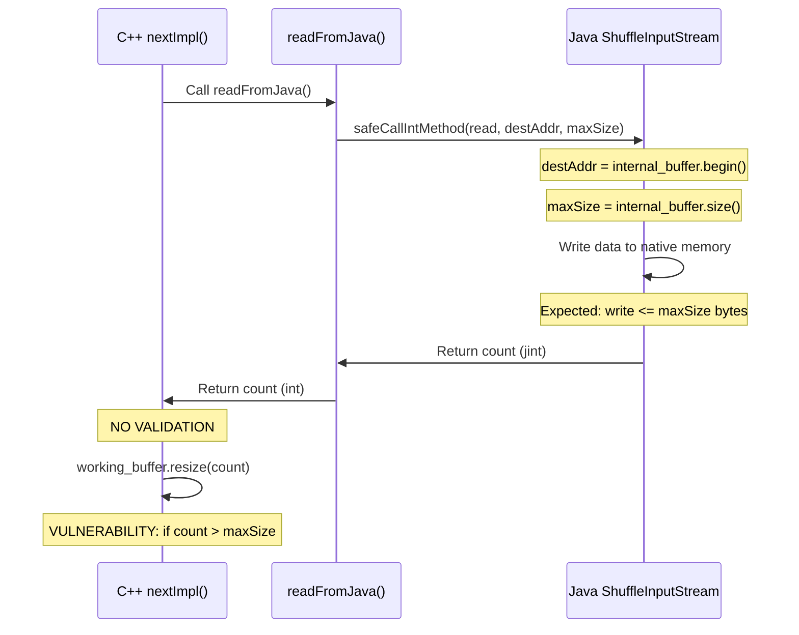

# Vulnerability Report: VULN-SHUFFLE-001

## Summary

| Field | Value |
|-------|-------|
| **Vulnerability ID** | VULN-SHUFFLE-001 |
| **Type** | Buffer Overflow (CWE-120) |
| **Severity** | High |
| **Confidence** | 85% |
| **File** | `cpp-ch/local-engine/Shuffle/ShuffleReader.cpp` |
| **Lines** | 68-74 |
| **Function** | `ReadBufferFromJavaInputStream::nextImpl` |
| **CWE Reference** | CWE-120: Buffer Copy without Checking Size of Input |

---

## Vulnerability Description

The vulnerability exists in the JNI interface between C++ and Java code in the ShuffleReader component. The `nextImpl()` method uses the return value from a JNI call (`readFromJava()`) to resize the working buffer without validating that the returned count does not exceed the allocated internal buffer capacity.

### Core Issue

The C++ code receives a count value from Java via JNI and uses it directly for buffer resizing:

```cpp
bool ReadBufferFromJavaInputStream::nextImpl()
{
    int count = readFromJava();
    if (count > 0)
        working_buffer.resize(count);  // NO VALIDATION: count <= internal_buffer.size()
    return count > 0;
}
```

The `readFromJava()` method calls a Java InputStream:

```cpp
int ReadBufferFromJavaInputStream::readFromJava() const
{
    GET_JNIENV(env)
    jint count = safeCallIntMethod(
        env, java_in, ShuffleReader::input_stream_read, 
        reinterpret_cast<jlong>(internal_buffer.begin()), 
        internal_buffer.size());
    CLEAN_JNIENV
    return count;  // Returned without validation
}
```

The critical security flaw:

1. **No return value validation**: The returned `count` value is not validated against `internal_buffer.size()` before use
2. **Potential buffer overflow**: If Java returns a count larger than the buffer size, `working_buffer.resize(count)` creates a buffer beyond the data actually written
3. **Trust assumption without enforcement**: The code assumes the Java implementation follows the contract but does not enforce it

---

## Technical Analysis

### Data Flow

```
[IN] JNI Java InputStream
    │
    │   ShuffleInputStream.read(destAddress, maxReadSize)
    │   └─► Java writes to internal_buffer.begin()
    │   └─► Java returns count (bytes read)
    │
[BUFFER] internal_buffer (allocated with fixed size)
    │   └─► Data written by Java up to maxReadSize
    │
[OUT] working_buffer.resize(count)
    │   └─► NO VALIDATION: count vs internal_buffer.size()
    │   └─► If count > internal_buffer.size(): overflow risk
```

### Control Flow Diagram



### Vulnerable Code

**ShuffleReader.cpp (Lines 68-83):**

```cpp
bool ReadBufferFromJavaInputStream::nextImpl()
{
    int count = readFromJava();
    if (count > 0)
        working_buffer.resize(count);  // VULNERABLE: unvalidated count
    return count > 0;
}

int ReadBufferFromJavaInputStream::readFromJava() const
{
    GET_JNIENV(env)
    jint count = safeCallIntMethod(
        env, java_in, ShuffleReader::input_stream_read, 
        reinterpret_cast<jlong>(internal_buffer.begin()),  // Buffer pointer passed
        internal_buffer.size());                            // Size limit passed
    CLEAN_JNIENV
    return count;                                           // No validation
}
```

### Safe Pattern Comparison

Compare with the safe implementation in `ReadBufferFromByteArray::nextImpl()`:

```cpp
bool ReadBufferFromByteArray::nextImpl()
{
    if (read_pos >= array_size)
        return false;

    GET_JNIENV(env)
    const size_t read_size = std::min(internal_buffer.size(), array_size - read_pos);  // VALIDATION!
    env->GetByteArrayRegion(array, read_pos, read_size, reinterpret_cast<jbyte *>(internal_buffer.begin()));
    working_buffer.resize(read_size);  // Uses validated size
    read_pos += read_size;
    CLEAN_JNIENV
    return true;
}
```

**Key difference**: The safe pattern uses `std::min()` to ensure the read size never exceeds buffer capacity.

---

## Attack Vectors

### 1. Return Value Manipulation

If a malicious or buggy Java implementation returns a count value larger than `internal_buffer.size()`:

- **Effect**: `working_buffer.resize(count)` creates a buffer larger than the actual data
- **Impact**: Reading uninitialized memory, information disclosure, potential crash

**Scenario**: A custom `ShuffleInputStream` implementation could return:
```java
public long read(long destAddress, long maxReadSize) {
    // Malicious: return count > maxReadSize
    return maxReadSize * 2;  // Exceeds buffer capacity
}
```

### 2. Direct Memory Overflow

If the Java implementation writes more data than `maxReadSize` and returns a matching count:

- **Effect**: Memory corruption in native heap adjacent to `internal_buffer`
- **Impact**: Process crash, arbitrary code execution, data corruption

### 3. Integer Overflow/Underflow

The return type is `jint` (32-bit signed integer), while `internal_buffer.size()` is `size_t` (64-bit on most platforms):

- **Effect**: Potential integer truncation issues when comparing count to size
- **Impact**: If `internal_buffer.size()` is very large, negative values could bypass the `count > 0` check

---

## Security Implications

### Memory Corruption (CWE-120)
- If Java writes beyond `internal_buffer.size()`, adjacent heap objects could be corrupted
- Could lead to arbitrary code execution if critical structures are overwritten

### Information Disclosure (CWE-125)
- If `working_buffer.resize(count)` creates a buffer larger than data written
- Sensitive data from adjacent memory regions could be exposed when reading

### Denial of Service
- Invalid count values could cause:
  - Buffer allocation failures (memory exhaustion)
  - Process crashes due to memory corruption
  - Out-of-bounds access causing segfaults

---

## Exploitability Assessment

### Prerequisites
1. Attacker must control the Java `ShuffleInputStream` implementation
2. Or there must be a bug in existing Java implementations that returns invalid count
3. JNI boundary must be reachable (shuffle data flow path)

### Existing Java Implementation Analysis

**OnHeapCopyShuffleInputStream.java (Lines 38-60):**

```java
@Override
public long read(long destAddress, long maxReadSize) {
    try {
        int maxReadSize32 = Math.toIntExact(maxReadSize);
        if (buffer == null || maxReadSize32 > buffer.length) {
            this.buffer = new byte[maxReadSize32];
        }
        int read = in.read(buffer, 0, maxReadSize32);
        if (read == -1 || read == 0) {
            return 0;
        }
        PlatformDependent.copyMemory(buffer, 0, destAddress, read);
        bytesRead += read;
        return read;  // Returns actual bytes read, bounded by maxReadSize32
    } catch (Exception e) {
        throw new GlutenException(e);
    }
}
```

**Analysis**: The current implementation appears safe because:
- `read` is bounded by `maxReadSize32` (converted from `maxReadSize`)
- Returns actual bytes read, which cannot exceed `maxReadSize32`

**However**: The interface contract is not enforced at the C++ level, leaving room for:
- Custom malicious implementations
- Future implementation bugs
- Race conditions or corruption in JNI layer

---

## Related Vulnerabilities

This vulnerability is closely related to **SHUFFLE-006**:

| ID | Focus | CWE |
|----|-------|-----|
| VULN-SHUFFLE-001 | Buffer overflow from unvalidated count | CWE-120 |
| SHUFFLE-006 | JNI pointer exposure / out-of-bounds read | CWE-125 |

Both vulnerabilities stem from the same root cause: lack of validation at the JNI boundary.

---

## Evidence of Vulnerability

### Code Pattern Analysis

| Aspect | Finding |
|--------|---------|
| **Input validation** | None - count is used directly |
| **Bounds checking** | Missing - no comparison to buffer size |
| **Error handling** | Basic JNI exception handling only |
| **Type safety** | jint to int conversion, size_t comparison issues |

### Static Analysis Findings

- **Pattern**: JNI return value used without validation for buffer operations
- **Risk**: High - buffer resize with untrusted value
- **Context**: ShuffleReader data flow path is reachable during Spark shuffle operations

---

## Related Files

| File | Role | Location |
|------|------|----------|
| ShuffleReader.cpp | Vulnerable code | `/cpp-ch/local-engine/Shuffle/ShuffleReader.cpp` |
| ShuffleReader.h | Class definition | `/cpp-ch/local-engine/Shuffle/ShuffleReader.h` |
| jni_common.h | JNI helper functions | `/cpp-ch/local-engine/jni/jni_common.h` |
| local_engine_jni.cpp | JNI initialization | `/cpp-ch/local-engine/local_engine_jni.cpp` |
| ShuffleInputStream.java | Java interface | `/backends-clickhouse/src/main/java/org/apache/gluten/vectorized/ShuffleInputStream.java` |
| OnHeapCopyShuffleInputStream.java | Java implementation | `/backends-clickhouse/src/main/java/org/apache/gluten/vectorized/OnHeapCopyShuffleInputStream.java` |

---

## Mitigation Recommendations

### 1. Add Return Value Validation (Primary Fix)

```cpp
bool ReadBufferFromJavaInputStream::nextImpl()
{
    int count = readFromJava();
    if (count > 0) {
        // Validate count is within bounds
        size_t safe_count = std::min(static_cast<size_t>(count), internal_buffer.size());
        if (count > static_cast<int>(internal_buffer.size())) {
            LOG_WARNING(&Poco::Logger::get("ShuffleReader"),
                       "Java returned count {} exceeds buffer size {}, using safe_count",
                       count, internal_buffer.size());
        }
        working_buffer.resize(safe_count);
    }
    return count > 0;
}
```

### 2. Validate in readFromJava()

```cpp
int ReadBufferFromJavaInputStream::readFromJava() const
{
    GET_JNIENV(env)
    jint count = safeCallIntMethod(
        env, java_in, ShuffleReader::input_stream_read, 
        reinterpret_cast<jlong>(internal_buffer.begin()), 
        internal_buffer.size());
    CLEAN_JNIENV
    
    // Validate count is within buffer bounds
    if (count > static_cast<jint>(internal_buffer.size())) {
        LOG_ERROR(&Poco::Logger::get("ShuffleReader"),
                  "Invalid read count from Java: {} > buffer size: {}",
                  count, internal_buffer.size());
        // Option 1: Throw exception
        throw DB::Exception(DB::ErrorCodes::LOGICAL_ERROR,
                            "Invalid read count from Java InputStream");
        // Option 2: Clamp to valid range
        // return static_cast<jint>(internal_buffer.size());
    }
    
    return count;
}
```

### 3. Add Java-side Contract Enforcement

Update the Java interface documentation:

```java
public interface ShuffleInputStream {
  /**
   * Read fixed size of data into an offheap address.
   * 
   * SECURITY CONTRACT:
   * 1. The returned value MUST be <= maxReadSize
   * 2. No more than maxReadSize bytes MUST be written to destAddress
   * 3. A negative return value indicates error, non-negative indicates bytes read
   * 
   * Violations of this contract may cause buffer overflow in native code.
   *
   * @return the read bytes; MUST be <= maxReadSize; 0 if end of stream.
   */
  long read(long destAddress, long maxReadSize);
}
```

### 4. Use Defensive Programming Pattern

Follow the pattern used in `ReadBufferFromByteArray`:
- Always calculate safe bounds before operations
- Use `std::min()` to clamp values
- Validate before resize operations

---

## Confidence Assessment

| Factor | Score | Reason |
|--------|-------|--------|
| **Code Pattern** | High | Clear missing validation pattern |
| **CWE Classification** | High | Matches CWE-120 criteria exactly |
| **Attack Feasibility** | Medium | Requires custom/malicious Java implementation |
| **Existing Exploits** | Low | No known exploits in current implementation |
| **Mitigation Presence** | None | No validation found in code |

**Overall Confidence: 85%**

The vulnerability pattern is clear and represents a real security risk. The current Java implementation appears safe, but:
1. The interface contract is not enforced at the C++ boundary
2. Future custom implementations could violate the contract
3. Bugs in existing implementations could emerge
4. JNI-level corruption could manipulate return values

---

## References

- [CWE-120: Buffer Copy without Checking Size of Input](https://cwe.mitre.org/data/definitions/120.html)
- [CWE-125: Out-of-bounds Read](https://cwe.mitre.org/data/definitions/125.html)
- [JNI Best Practices](https://docs.oracle.com/javase/8/docs/technotes/guides/jni/spec/design.html)
- [JNI Security Considerations](https://www.oracle.com/java/technologies/jni-security.html)
- [SEI CERT C Coding Standard - INT05-C](https://wiki.sei.cmu.edu/confluence/display/c/INT05-C)

---

## History

| Date | Action | Details |
|------|--------|---------|
| 2026-04-23 | Vulnerability identified | Static analysis detected buffer resize with unvalidated JNI return |
| 2026-04-23 | Duplicate detected | Identified as near-duplicate of SHUFFLE-006 |
| 2026-04-23 | Report generated | Detailed technical analysis completed |

---

## Appendix: Complete Code Context

### ShuffleReader.cpp (Lines 65-95)

```cpp
jclass ShuffleReader::input_stream_class = nullptr;
jmethodID ShuffleReader::input_stream_read = nullptr;

bool ReadBufferFromJavaInputStream::nextImpl()
{
    int count = readFromJava();
    if (count > 0)
        working_buffer.resize(count);
    return count > 0;
}

int ReadBufferFromJavaInputStream::readFromJava() const
{
    GET_JNIENV(env)
    jint count = safeCallIntMethod(
        env, java_in, ShuffleReader::input_stream_read, reinterpret_cast<jlong>(internal_buffer.begin()), internal_buffer.size());
    CLEAN_JNIENV
    return count;
}

ReadBufferFromJavaInputStream::ReadBufferFromJavaInputStream(jobject input_stream) : java_in(input_stream)
{
}

ReadBufferFromJavaInputStream::~ReadBufferFromJavaInputStream()
{
    GET_JNIENV(env)
    env->DeleteGlobalRef(java_in);
    CLEAN_JNIENV
}
```

### ShuffleReader.h (Lines 55-65)

```cpp
class ReadBufferFromJavaInputStream final : public DB::BufferWithOwnMemory<DB::ReadBuffer>
{
public:
    explicit ReadBufferFromJavaInputStream(jobject input_stream);
    ~ReadBufferFromJavaInputStream() override;

private:
    jobject java_in;
    int readFromJava() const;
    bool nextImpl() override;
};
```

### JNI Initialization (local_engine_jni.cpp)

```cpp
// Lines 122-136 (approximate)
local_engine::ShuffleReader::input_stream_class
    = local_engine::CreateGlobalClassReference(env, "Lorg/apache/gluten/vectorized/ShuffleInputStream;");

local_engine::ShuffleReader::input_stream_read
    = local_engine::GetMethodID(env, local_engine::ShuffleReader::input_stream_class, "read", "(JJ)J");
```

The JNI method signature `"(JJ)J"` indicates:
- Parameters: two jlong values (destAddress, maxReadSize)
- Return: jlong (bytes read) - cast to jint in safeCallIntMethod

---

## Appendix: Buffer Relationship in ClickHouse ReadBuffer

The `BufferWithOwnMemory<ReadBuffer>` base class manages two key buffers:

| Buffer | Purpose | Allocation |
|--------|---------|------------|
| `internal_buffer` | Memory owned by the buffer, used for I/O operations | Fixed size (DBMS_DEFAULT_BUFFER_SIZE or custom) |
| `working_buffer` | View into internal_buffer for data processing | Resized based on actual data |

The vulnerability occurs because:
1. Java writes to `internal_buffer` (passed via pointer)
2. Java returns `count` (bytes it claims to have written)
3. `working_buffer.resize(count)` assumes `count` is valid
4. If `count > internal_buffer.size()`, the resize creates an invalid view

<!-- OMO_INTERNAL_INITIATOR -->
