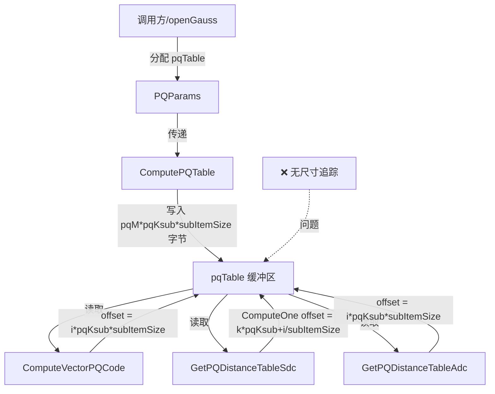

# 深度利用分析报告: VULN-DF-CORE-020

## 漏洞概要

| 字段 | 值 |
|------|-----|
| 漏洞 ID | VULN-DF-CORE-020 |
| 类型 | cross_module_data_flow |
| 严重性 | High |
| CWE | CWE-119: Improper Restriction of Operations within the Bounds of a Memory Buffer |
| 文件 | src/kvecturbo.cpp |
| 行号 | 1027-1038 |
| 函数 | ComputePQTable (及多个下游函数) |
| 置信度 | 85 |

## 漏洞描述

`pqTable` 缓冲区在多个 API 函数间共享，但缺乏跨模块的尺寸追踪机制。`ComputePQTable` 写入 `pqTable` 后，`ComputeVectorPQCode`、`GetPQDistanceTableSdc`、`GetPQDistanceTableAdc` 等下游函数读取该缓冲区。

由于没有统一的尺寸参数传递，每个函数都假设 `pqTable` 具有足够容量，这本质上是 VULN-DF-CORE-002 的**跨模块视角分析**。

## 跨模块数据流分析

### 模块边界

```
┌─────────────────────────────────────────────────────────────┐
│                     API Module (include)                    │
│  ┌─────────────────────────────────────────────────────────┐│
│  │ PQParams 结构体                                          ││
│  │ ├── char *pqTable (缓冲区指针)                           ││
│  │ ├── int pqM (子空间数)                                   ││
│  │ ├── int pqKsub (每子空间聚类数)                          ││
│  │ ├── int dim (维度)                                       ││
│  │ └── size_t subItemSize (子向量尺寸)                      ││
│  │ ❌ 缺失: pqTable_size (缓冲区实际尺寸)                   ││
│  └─────────────────────────────────────────────────────────┘│
└─────────────────────────────────────────────────────────────┘
                              │
                              ▼ 跨模块传递 (无尺寸追踪)
┌─────────────────────────────────────────────────────────────┐
│                    Core Module (src)                        │
│                                                             │
│  ComputePQTable        ──────►  写入 pqTable                │
│  ComputeVectorPQCode   ──────►  读取 pqTable                │
│  GetPQDistanceTableSdc ──────►  读取 pqTable                │
│  GetPQDistanceTableAdc ──────►  读取 pqTable                │
│  GetPQDistance         ──────►  间接依赖 pqTable            │
│                                                             │
│  ❌ 所有函数假设 pqTable 尺寸 >= pqM * pqKsub * subItemSize │
└─────────────────────────────────────────────────────────────┘
```

### 函数间数据流



### 详细数据流追踪

**ComputePQTable (写入者)**:

```cpp
// Line 950: 获取 pqTable 指针
char *const pqTable = params->pqTable;

// Line 1028-1031: 写入循环
for (int m = 0; m < pqM; m++) {
    for (int i = 0; i < pqKsub; i++) {
        memcpy_s(pqTable + (m * pqKsub + i) * centers->itemSize, ...);
    }
}
// 总写入量: pqM * pqKsub * centers->itemSize 字节
```

**ComputeVectorPQCode (读取者)**:

```cpp
// Line 1172: 获取 pqTable 指针
char *pqTable = params->pqTable;

// Line 1198: 计算偏移访问
Vector *tempVec2 = reinterpret_cast<Vector *>(pqTable + (i * pqKsub) * subItemSize);
// 假设 pqTable 至少有 pqM * pqKsub * subItemSize 字节
```

**GetPQDistanceTableSdc (读取者)**:

```cpp
// Line 1226 (ComputeOne 内部): 计算偏移访问
Vector *vec1 = reinterpret_cast<Vector *>(pqTable + (k * pqKsub + i) * subItemSize);
Vector *vec2 = reinterpret_cast<Vector *>(pqTable + (k * pqKsub + j) * subItemSize);
// 假设 pqTable 至少有 pqM * pqKsub * subItemSize 字节
```

**GetPQDistanceTableAdc (读取者)**:

```cpp
// Line 1365: 计算偏移访问
Vector *tmpvec = reinterpret_cast<Vector *>(pqTable + (i * pqKsub) * subItemSize);
// 假设 pqTable 至少有 pqM * pqKsub * subItemSize 字节
```

## 问题根源分析

### 缺失的尺寸参数

| 位置 | 期望参数 | 实际状态 |
|------|----------|----------|
| PQParams 结构体 | `size_t pqTable_size` | ❌ 缺失 |
| ComputePQTable API | `size_t pqTable_size` 参数 | ❌ 缺失 |
| ComputeVectorPQCode API | pqTable 尺寸验证 | ❌ 缺失 |
| GetPQDistanceTableSdc API | pqDistanceTable 尺寸验证 | ✓ 有 (Line 1286) |
| GetPQDistanceTableAdc API | pqDistanceTable 尺寸验证 | ✓ 有 (Line 1341) |

### 尺寸计算对比

| 函数 | 期望 pqTable 尺寸 | 验证状态 |
|------|-------------------|----------|
| ComputePQTable | pqM * pqKsub * subItemSize | ❌ 无 |
| ComputeVectorPQCode | pqM * pqKsub * subItemSize | ❌ 无 |
| GetPQDistanceTableSdc | pqM * pqKsub * subItemSize | ❌ 无 (仅验证 pqDistanceTable) |
| GetPQDistanceTableAdc | pqM * pqKsub * subItemSize | ❌ 无 (仅验证 pqDistanceTable) |

## 与 VULN-DF-CORE-002 的关系

VULN-DF-CORE-020 与 VULN-DF-CORE-002 描述同一安全缺陷的不同方面：

| 维度 | VULN-DF-CORE-002 | VULN-DF-CORE-020 |
|------|------------------|------------------|
| 焦点 | ComputePQTable 内部缓冲区溢出 | 跨模块数据流风险 |
| 漏洞点 | memcpy_s 写入越界 | 多函数共享缓冲区无尺寸追踪 |
| 根因 | 缺失 pqTable 尺寸验证 | 缺失跨模块尺寸参数传递 |
| 影响 | 直接溢出 | 连带访问越界风险 |

**本质**: 同一缺陷的**单点视角** vs **系统视角**分析。

## 利用分析

### 攻击场景

**场景 1: 跨模块连锁溢出**

```
1. 攻击者调用 ComputePQTable
   ├── 分配小 pqTable 缓冲区
   ├── ComputePQTable 写入越界
   └── pqTable 内容被破坏

2. 后续调用 ComputeVectorPQCode
   ├── 读取被破坏的 pqTable
   ├── 偏移计算基于假设尺寸
   └── 访问超出实际分配边界
   └── 可能访问其他内存区域

3. 距离计算函数被调用
   ├── GetPQDistanceTableSdc/Adc
   ├── 读取越界内存
   └── 可能泄露数据或触发崩溃
```

**场景 2: 时序攻击**

```
时间线:
T0: ComputePQTable 正常完成 (pqTable 正确尺寸)
T1: 调用方释放或修改 pqTable 内存
T2: ComputeVectorPQCode 被调用
    └── 访问已释放内存 (Use-After-Free)
```

### 可利用性

| 条件 | 状态 | 说明 |
|------|------|------|
| 缓冲区尺寸可控 | ✓ 是 | pqTable 由调用方分配 |
| 尺寸追踪缺失 | ✓ 是 | 无统一验证机制 |
| 多函数依赖 | ✓ 是 | 4+ 函数依赖 pqTable |
| 跨模块调用链 | ✓ 是 | API → Core 模块调用 |

## 影响评估

### 直接影响

| 影响 | 级别 | 描述 |
|------|------|------|
| 内存访问越界 | High | 读取超出分配边界 |
| 数据泄露 | Medium | 可能泄露相邻内存 |
| Use-After-Free风险 | Medium | 如果调用方不当管理内存 |
| 连带崩溃 | High | 多函数可能触发崩溃 |

### 系统级影响

- 所有依赖 pqTable 的 API 都面临风险
- 搜索精度可能受影响（距离计算错误）
- 可能触发链式漏洞（一个溢出导致多个函数失败）

## 修复建议

### 系统级修复方案

**方案 1: 添加 pqTable_size 参数到 PQParams**

```cpp
typedef struct PQParams {
    int pqM;
    int pqKsub;
    int funcType;
    int dim;
    size_t subItemSize;
    char *pqTable;
    size_t pqTable_size;  // 新增: 缓冲区实际尺寸
} PQParams;
```

**方案 2: 每个函数添加尺寸验证**

```cpp
int ComputeVectorPQCode(float *vector, const PQParams *params, unsigned char *pqCode, size_t pqCode_size)
{
    // ... 现有检查 ...
    
    // 新增: pqTable 尺寸验证
    size_t requiredPqTableSize = static_cast<size_t>(pqM) * pqKsub * subItemSize;
    if (params->pqTable_size < requiredPqTableSize) {
        std::cerr << "Error: pqTable buffer too small" << std::endl;
        return -1;
    }
    
    // ... 继续处理 ...
}
```

**方案 3: 统一验证函数**

```cpp
// 新增验证辅助函数
static bool ValidatePQTableSize(const PQParams *params) {
    size_t required = static_cast<size_t>(params->pqM) * params->pqKsub * params->subItemSize;
    return params->pqTable_size >= required;
}

// 所有依赖 pqTable 的函数开头调用
if (!ValidatePQTableSize(params)) {
    return -1;
}
```

## 结论

| 评估项 | 结论 |
|--------|------|
| 真实性 | **确认是真实漏洞** |
| 与 VULN-DF-CORE-002 关系 | **同一缺陷的跨模块视角** |
| 严重性 | High |
| 系统性风险 | 高 (影响多个 API) |
| 修复优先级 | P0 (与 VULN-DF-CORE-002 同修复) |

### 建议

此漏洞与 VULN-DF-CORE-002 应**统一修复**：

1. 在 PQParams 结构体添加 `pqTable_size` 字段
2. ComputePQTable 验证写入尺寸不超缓冲区
3. 所有读取 pqTable 的函数验证缓冲区尺寸
4. API 文档明确缓冲区尺寸要求

**合并修复方案将同时解决 VULN-DF-CORE-002 和 VULN-DF-CORE-020**。