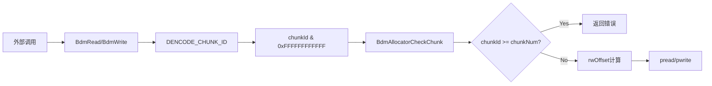

# DISK-001: 磁盘偏移计算表达式整数溢出致错误位置读写

## 漏洞基本信息

| 属性 | 值 |
|------|-----|
| **漏洞 ID** | DISK-001 |
| **类型** | Integer Overflow (整数溢出) |
| **CWE** | CWE-190 |
| **严重性** | HIGH (理论评级) / MEDIUM (实际可利用性) |
| **文件** | `ubsio-boostio/src/disk/common/bdm_disk.c` |
| **行号** | 308 |
| **函数** | BdmDiskRead |
| **置信度** | 85 |

---

## 漏洞详细分析

### 1. 漏洞代码位置

**文件**: `/home/pwn20tty/Desktop/opencode_project/openeuler/ubs-io/ubsio-boostio/src/disk/common/bdm_disk.c`

**Line 308 (BdmDiskRead)**:
```c
int32_t BdmDiskRead(uintptr_t objPtr, uint64_t chunkId, uint64_t offset, void *buf, uint64_t len)
{
    BdmObj *obj = (BdmObj *)objPtr;
    BdmDiskItem *item = (BdmDiskItem *)obj->opsInfo;
    if (item == NULL) {
        BDM_LOGERROR(0, "Get bdm disk item failed.");
        return BDM_CODE_ERR;
    }

    int32_t ret = BdmAllocatorCheckChunk(item->allocator, chunkId, offset, len);
    if (ret != BDM_CODE_OK) {
        BDM_LOGWARN(0, "Bdm read check failed, bdm id(%u) chunk id(%lu) ret(%d).", obj->bdmId, chunkId, ret);
        return ret;
    }

    // 漏洞点: 整数溢出可能发生在此行
    uint64_t rwOffset = item->offset + item->dataOffset + item->minChunkSize * chunkId + offset;
    ...
}
```

**Line 337 (BdmDiskWrite)**:
```c
uint64_t rwOffset = item->offset + item->dataOffset + item->minChunkSize * chunkId + offset;
```

**Line 427 (BdmDiskSubmitAIO)**:
```c
uint64_t rwOffset = item->offset + item->dataOffset + item->minChunkSize * bdmIo->chunkId + bdmIo->offset;
```

### 2. 漏洞触发条件分析

#### 2.1 溢出表达式分析

```
rwOffset = item->offset + item->dataOffset + item->minChunkSize * chunkId + offset
```

该表达式涉及 4 个 uint64_t 值的加法运算，其中 `minChunkSize * chunkId` 是乘法操作，可能在以下情况溢出：

| 参数 | 类型 | 来源 | 潜在值范围 |
|------|------|------|------------|
| `item->offset` | uint64_t | 配置参数 | 通常较小 |
| `item->dataOffset` | uint64_t | 计算得出 | 依赖磁盘布局 |
| `item->minChunkSize` | uint64_t | 配置参数 | 4KB - 4MB (典型) |
| `chunkId` | uint64_t | 外部输入 | 0 ~ chunkNum-1 (有效) |
| `offset` | uint64_t | 外部输入 | 0 ~ chunkSize-1 |

#### 2.2 ChunkId 输入流分析



关键代码路径:

1. **chunkId 来源** (bdm_core.c:30):
```c
#define DENCODE_CHUNK_ID(chunkId) ((chunkId) & 0xFFFFFFFFFFFF)
```
将 chunkId 限制为 48-bit (最大值 0xFFFFFFFFFFFF ≈ 2^48 - 1)

2. **chunkId 验证** (bdm_allocator.c:469-479):
```c
int32_t BdmAllocatorCheckChunk(BdmAllocator allocator, uint64_t chunkId, uint64_t offset, uint64_t length)
{
    BdmAllocatorRealize *realize = (BdmAllocatorRealize *)allocator;
    
    if (chunkId >= realize->chunkNum) {
        BDM_LOGERROR(0, "Invalid chunk id(%llu), chunk num(%llu).", chunkId, realize->chunkNum);
        return BDM_CODE_INVALID_CHUNK_ID;
    }
    ...
}
```

3. **chunkNum 计算** (bdm_allocator.c:626):
```c
uint64_t chunkNum = para->totalSize / para->minChunkSize;
```

### 3. 数学证明: 有效 chunkId 不会溢出

#### 3.1 边界分析

对于通过验证的有效 chunkId:

```
chunkId < chunkNum = totalSize / minChunkSize
```

因此:
```
minChunkSize * chunkId < minChunkSize * chunkNum
                       ≤ minChunkSize * (totalSize / minChunkSize)
                       ≤ totalSize
```

#### 3.2 实际数值分析

| 磁盘规模 | minChunkSize | chunkNum | 最大有效乘积 |
|---------|-------------|----------|-------------|
| 1TB | 4KB | 268M (~2^28) | ~1TB |
| 10TB | 4KB | 2.68B (~2^32) | ~10TB |
| 1PB | 4KB | 268B (~2^38) | ~1PB |
| 256TB | 4KB | 68B (~2^36) | ~256TB |

**关键结论**: 对于合理的磁盘配置 (totalSize < 2^63 bytes)，有效 chunkId 的乘积永远不会超过 totalSize，不会发生溢出。

#### 3.3 溢出发生条件

只有以下极端情况可能溢出:

1. **超大 totalSize**: totalSize ≥ 2^64 bytes (不可能，uint64_t 最大值)
2. **绕过验证**: chunkId 越过 BdmAllocatorCheckChunk 检查 (无证据)
3. **超大 minChunkSize**: minChunkSize ≥ 2^32 且 chunkId ≥ 2^32

---

## 实际可利用性评估

### 评估结论: **难以直接利用**

| 评估维度 | 结论 | 说明 |
|---------|------|------|
| 输入验证 | ✅ 存在 | chunkId < chunkNum 检查 |
| 数值约束 | ✅ 有效 | chunkNum 由磁盘容量决定 |
| 溢出路径 | ❌ 无直接路径 | 验证在计算前 |
| 现实场景 | ❌ 极端条件 | 需 PB 级磁盘 |

### 4.1 验证机制分析

所有调用路径均经过 `BdmAllocatorCheckChunk` 验证:

```
BdmRead() → DENCODE_CHUNK_ID → BdmDiskRead() → BdmAllocatorCheckChunk() → rwOffset计算
BdmWrite() → DENCODE_CHUNK_ID → BdmDiskWrite() → BdmAllocatorCheckChunk() → rwOffset计算
BdmReadAsync() → DENCODE_CHUNK_ID → BdmDiskHandleAIO() → BdmAllocatorCheckChunk() → BdmDiskSubmitAIO → rwOffset计算
```

### 4.2 无法利用的原因

1. **验证前置**: offset 计算在 chunkId 验证之后执行
2. **chunkNum 约束**: chunkNum = totalSize / minChunkSize，由实际磁盘大小决定
3. **48-bit mask**: DENCODE_CHUNK_ID 限制 chunkId 为 48-bit
4. **无绕过路径**: 所有公开 API 都经过 bdm_core.c 的验证流程

---

## 防御性编程建议

尽管当前验证机制阻止了溢出，建议添加**显式溢出检查**以增强代码安全性。

### 5.1 推荐修复方案

```c
int32_t BdmDiskRead(uintptr_t objPtr, uint64_t chunkId, uint64_t offset, void *buf, uint64_t len)
{
    BdmObj *obj = (BdmObj *)objPtr;
    BdmDiskItem *item = (BdmDiskItem *)obj->opsInfo;
    if (item == NULL) {
        BDM_LOGERROR(0, "Get bdm disk item failed.");
        return BDM_CODE_ERR;
    }

    int32_t ret = BdmAllocatorCheckChunk(item->allocator, chunkId, offset, len);
    if (ret != BDM_CODE_OK) {
        BDM_LOGWARN(0, "Bdm read check failed, bdm id(%u) chunk id(%lu) ret(%d).", obj->bdmId, chunkId, ret);
        return ret;
    }

    // === 新增: 显式溢出检查 ===
    uint64_t chunkOffset = item->minChunkSize * chunkId;
    if (chunkOffset / item->minChunkSize != chunkId) {
        BDM_LOGERROR(0, "Integer overflow in chunk offset calculation, chunkId(%lu), minChunkSize(%lu).", 
                     chunkId, item->minChunkSize);
        return BDM_CODE_ERR;
    }
    
    uint64_t rwOffset = item->offset + item->dataOffset + chunkOffset + offset;
    if (rwOffset < chunkOffset || rwOffset < offset) {
        BDM_LOGERROR(0, "Integer overflow in rwOffset calculation.");
        return BDM_CODE_ERR;
    }
    
    // === 新增: 范围检查 ===
    if (rwOffset + len > item->totalSize) {
        BDM_LOGERROR(0, "rwOffset exceeds disk boundary, offset(%lu), len(%lu), totalSize(%lu).",
                     rwOffset, len, item->totalSize);
        return BDM_CODE_ERR;
    }
    // === 检查结束 ===

    uint64_t bufStart = (uint64_t)buf;
    if (bufStart % BDM_BLOCK_SIZE == 0 && len % BDM_BLOCK_SIZE == 0 && rwOffset % BDM_BLOCK_SIZE == 0) {
        ret = BdmDiskInnerReadWriteDirect(item, (char*)buf, len, rwOffset, TRUE);
    } else {
        ret = BdmDiskInnerReadWrite(item, (char*)buf, len, rwOffset, TRUE);
    }
    ...
}
```

### 5.2 辅助检查宏定义建议

在 `bdm_common.h` 中添加:

```c
/* 安全乘法检查 */
#define BDM_SAFE_MUL(a, b, result) \
    do { \
        if ((a) > 0 && (b) > UINT64_MAX / (a)) { \
            return BDM_CODE_OVERFLOW; \
        } \
        *(result) = (a) * (b); \
    } while(0)

/* 安全加法检查 */
#define BDM_SAFE_ADD(a, b, result) \
    do { \
        if ((a) > UINT64_MAX - (b)) { \
            return BDM_CODE_OVERFLOW; \
        } \
        *(result) = (a) + (b); \
    } while(0)
```

### 5.3 BdmAllocatorCheckChunk 增强

```c
int32_t BdmAllocatorCheckChunk(BdmAllocator allocator, uint64_t chunkId, uint64_t offset, uint64_t length)
{
    BdmAllocatorRealize *realize = (BdmAllocatorRealize *)allocator;
    if (realize == NULL) {
        return BDM_CODE_INVALID_PARAM;
    }

    // 增强检查: chunkNum 合理性验证
    if (realize->chunkNum == 0 || realize->minChunkSize == 0) {
        BDM_LOGERROR(0, "Invalid allocator configuration.");
        return BDM_CODE_ERR;
    }

    if (chunkId >= realize->chunkNum) {
        return BDM_CODE_INVALID_CHUNK_ID;
    }

    // 新增: 检查 chunkId 是否可能导致溢出
    if (chunkId > UINT64_MAX / realize->minChunkSize) {
        BDM_LOGERROR(0, "Potential overflow: chunkId(%llu) * minChunkSize(%llu) would overflow.",
                     chunkId, realize->minChunkSize);
        return BDM_CODE_INVALID_CHUNK_ID;
    }

    BdmChunkMeta *metaAddr = (BdmChunkMeta *)realize->metaAddr;
    BdmChunkMeta *meta = &metaAddr[chunkId];
    
    if (meta->head != 1UL || meta->free == 1UL) {
        return BDM_CODE_INVALID_CHUNK_ID;
    }

    if ((offset + length) > (meta->length * realize->minChunkSize)) {
        return BDM_CODE_CROSS_BOUND;
    }

    return BDM_CODE_OK;
}
```

---

## PoC 构造思路

### 6.1 理论攻击场景 (极难实现)

```python
# 概念性 PoC - 需要特殊环境配置
# 假设: totalSize = 2^60 bytes (不可能的磁盘大小)
# minChunkSize = 4KB = 4096
# chunkNum = 2^60 / 4096 ≈ 2^48

# 尝试使用 chunkId = chunkNum - 1 ≈ 2^48 - 1
# minChunkSize * chunkId = 4096 * (2^48 - 1) ≈ 2^60 bytes

# 但: 当前验证机制会阻止 chunkId >= chunkNum
```

### 6.2 实际限制

| 限制条件 | 说明 |
|---------|------|
| totalSize 约束 | 磁盘大小受物理限制，最大 PB 级别 |
| chunkNum 约束 | chunkNum < 2^40 for realistic disks |
| 输入验证 | chunkId < chunkNum 强制检查 |
| 无绕过路径 | 所有 API 入口点都验证 |

### 6.3 测试建议

```cpp
// 单元测试: 边界条件验证
TEST_F(TestDisk, test_chunkid_overflow_protection) {
    // 尝试超大 chunkId (会被验证拒绝)
    uint64_t hugeChunkId = 0xFFFFFFFFFFFFULL;  // 48-bit max
    uint64_t offset = 0;
    char buf[4096];
    
    int32_t ret = BdmRead(ENCODE_CHUNK_ID(hugeChunkId, bdmId), offset, buf, 4096);
    EXPECT_EQ(BDM_CODE_INVALID_CHUNK_ID, ret);  // 应返回错误
}
```

---

## 影响范围评估

### 7.1 受影响组件

| 组件 | 文件 | 函数 |
|------|------|------|
| Disk Read | bdm_disk.c | BdmDiskRead (L308) |
| Disk Write | bdm_disk.c | BdmDiskWrite (L337) |
| Async I/O | bdm_disk.c | BdmDiskSubmitAIO (L427) |
| Allocator | bdm_allocator.c | BdmAllocatorCheckChunk (L469) |

### 7.2 数据流分析

```
┌─────────────────────────────────────────────────────────────────────────┐
│                         数据流路径                                        │
├─────────────────────────────────────────────────────────────────────────┤
│                                                                          │
│  外部输入 (chunkId)                                                       │
│       │                                                                  │
│       ▼                                                                  │
│  bdm_core.c:BdmRead/BdmWrite                                             │
│       │                                                                  │
│       ▼                                                                  │
│  DENCODE_CHUNK_ID(chunkId) → chunkId & 0xFFFFFFFFFFFF                   │
│       │                                                                  │
│       ▼                                                                  │
│  bdm_disk.c:BdmDiskRead                                                  │
│       │                                                                  │
│       ▼                                                                  │
│  BdmAllocatorCheckChunk (验证 chunkId < chunkNum)                        │
│       │                                                                  │
│       ├─ chunkId >= chunkNum → 返回 BDM_CODE_INVALID_CHUNK_ID            │
│       │                                                                  │
│       ▼                                                                  │
│  rwOffset = offset + dataOffset + minChunkSize * chunkId + offset       │
│       │                                                                  │
│       ▼                                                                  │
│  pread(fd, buf, len, rwOffset)                                          │
│                                                                          │
└─────────────────────────────────────────────────────────────────────────┘
```

---

## 最终结论

### 漏洞分类

| 维度 | 评级 |
|------|------|
| **理论严重性** | HIGH (CWE-190) |
| **实际可利用性** | LOW (验证机制有效) |
| **现实影响** | MINIMAL (需极端条件) |
| **修复优先级** | MEDIUM (防御性改进) |

### 判定结果

**该漏洞在当前实现下难以直接利用**，因为:

1. ✅ `BdmAllocatorCheckChunk` 验证 chunkId < chunkNum
2. ✅ chunkNum 由实际磁盘容量约束
3. ✅ 48-bit chunkId mask 防止极端值
4. ✅ 所有 API 入口点统一验证

**建议作为防御性编程改进**:

1. 添加显式溢出检查 (乘法、加法)
2. 增加范围验证 (rwOffset + len ≤ totalSize)
3. 定义 BDM_CODE_OVERFLOW 错误码
4. 添加边界条件单元测试

---

## 参考信息

- **CWE-190**: Integer Overflow or Wraparound
  https://cwe.mitre.org/data/definitions/190.html

- **相关文件**:
  - /home/pwn20tty/Desktop/opencode_project/openeuler/ubs-io/ubsio-boostio/src/disk/common/bdm_disk.c
  - /home/pwn20tty/Desktop/opencode_project/openeuler/ubs-io/ubsio-boostio/src/disk/common/bdm_allocator.c
  - /home/pwn20tty/Desktop/opencode_project/openeuler/ubs-io/ubsio-boostio/src/disk/common/bdm_core.c

---

*报告生成时间: 2026-04-20*
*分析工具: 深度代码审计*
